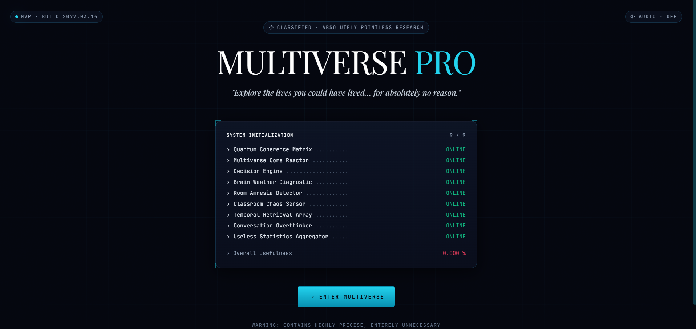
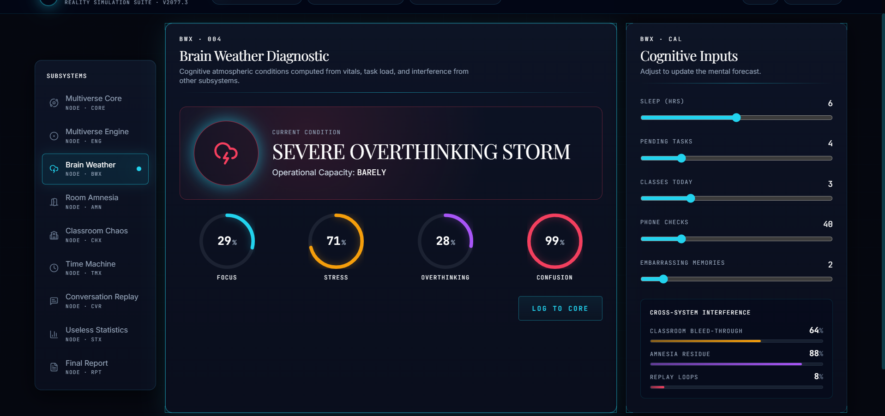
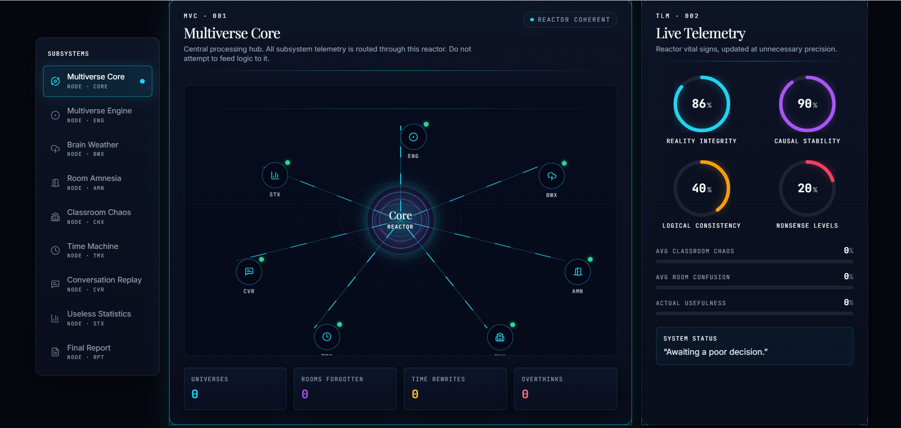
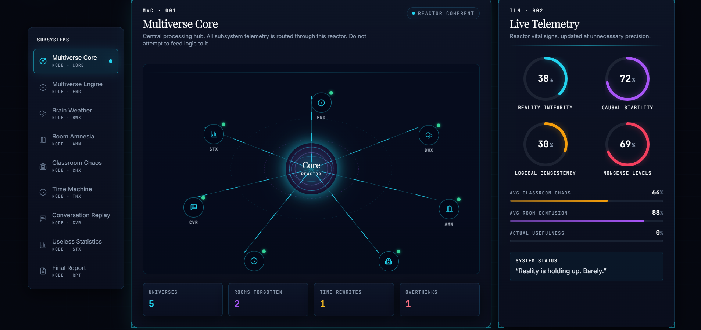

# Multiverse Pro 🎯

## Basic Details
### Team Name: Rocky

### Team Members
- Team Lead: Maheshwaer.G - [Christ College of Engineering, Irinjalakuda]
- Member 2: Adwaith Arun - [Christ College of Engineering, Irinjalakuda]

### Project Description
[MULTIVERSE PRO is a deliberately useless but surprisingly sophisticated interactive software system that explores the endless possibilities of everyday human decisions, thoughts, confusion, awkward moments, and completely unnecessary situations.]

### The Problem (that doesn't exist)
[the wasted moments in human life caused by overthinking and dumb decisions]

### The Solution (that nobody asked for)
[Multiverse pro, inspired by spiderman into the spider verse it aims to save time which it lost by human curiosity by wasting its own time]

## Technical Details
### Technologies/Components Used
For Software:
- [Languages used python, css, java, .json, etc]
- [Frameworks used React, FastAPI]
- [Libraries used Uvicorn, MongoDB/PyMongo, React component libraries and supporting JavaScript packages]
- [Tools used Visual Studio Code, Node.js, npm, Git, GitHub, Chrome/Microsoft Edge, PyInstaller]

For Hardware:
- [List main components Laptop/Desktop computer]
- [List specificationsWindows 10/11, minimum 4 GB RAM, dual-core processor or better, sufficient storage for project dependencies]
- [List tools required Node.js, Python, MongoDB, Git, and a modern web browser]

### Implementation
For Software:
# Installation
[1. Download or clone the MULTIVERSE PRO repository.
2. Extract the project folder if downloaded as a ZIP.
3. Make sure Python and the required dependencies are installed.
4. Start the included server using the provided launcher.]

# Run
[Once the server is running, open a web browser and visit:

    http://127.0.0.1:8000/v

The MULTIVERSE PRO interface will open directly in the browser.

No external website or internet-hosted application is required to run the local version.]

### Project Documentation
For Software:

# Screenshots (Add at least 3)
![Screenshot1]
*the start interface of multiverse pro *

![Screenshot2]
*one function of multiverse pro*

![Screenshot3] 
*before and after using multiverse pro*

# Diagrams

*how the system works*

For Hardware:

# Schematic & Circuit

*Add caption explaining connections*

*Add caption explaining the schematic*

# Build Photos

*List out all components shown*

*Explain the build steps*

*Explain the final build*

### Project Demo
# Video
<video controls src="20260912-0855-27.8066919.mp4" title="Title"></video>
*this video shows how the user can waste their time*

# Additional Demos
[Add any extra demo materials/links]

## Team Contributions
- [Maheshwear.G]: [wrote the whole code and program]
- [Adwaith Arun]: [Moral support, reasearch, presentation of videos and photos]

---
Made with ❤️ at TinkerHub Useless Projects 

